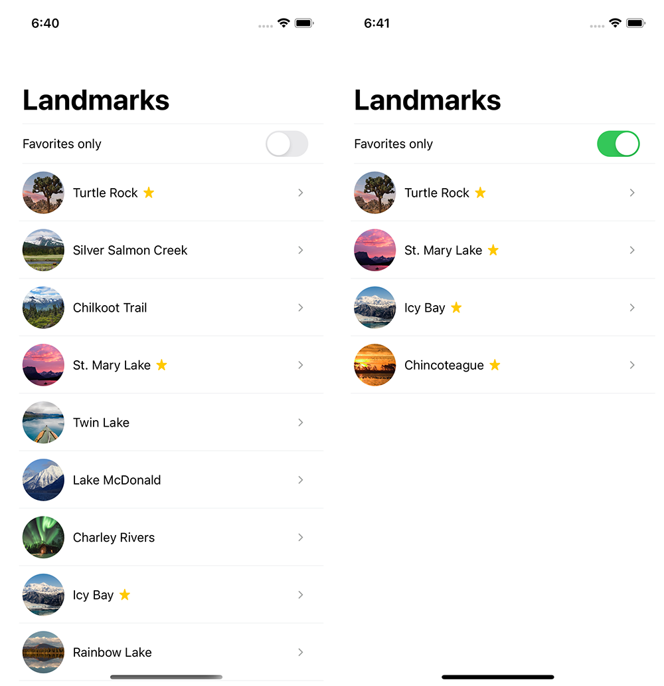

# FavoritePlaces
Проект выполнен в рамках тестового задания от компании WaveAccess

## Задача
Создать приложение, отображающее список локаций, загруженных из json-файла  
с возможностью просмотра информации о каждом конкретном месте с отображением  
его позиции на карте. Также, список можно фильтровать по избранным местам.

## Общие требования
- язык разработки - swift
- минимальная версия iOS - 13.0
- требования к дизайну - примерное соответствие [макетам](Тестовое%20задание/Макеты)
- менеджер зависимости carthage
- верстка через код с использованием SnapKit (​https://github.com/SnapKit/SnapKit)
- архитектура проекта: модифицированный VIPER (https://github.com/alfa-laboratory/YARCH)

P.S.  
На данный момент (18.05.22) аккаунт https://github.com/alfa-laboratory/ заблокирован;  
Актуальный форк с примером использования YARCH: https://github.com/aeternas/YARCH-Examples

____

### Первый экран
- Список с локациями;
- Отображать системную иконку “star.fill“, если место - избранное (isFavorite - флаг в модели); 
- По переключению свитча фильтровать список на только избранных



### Второй экран
- Детальное отображение места с картой, отображающей геопозицию из модели;
- По кнопке назад можно вернуть к списку


____

## Для запуска
1. Установить [Carthage](https://github.com/Carthage/Carthage):

	```bash
	brew install carthage
	```
2. Находясь в директории проекта запустить команду в терминале:

	```bash
	carthage update --use-xcframeworks
	```
3. Открыть файл `FavoritePlaces.xcodeproj`
4. Собрать проект (`Cmd+R` или `Product > Run` в меню XCode)